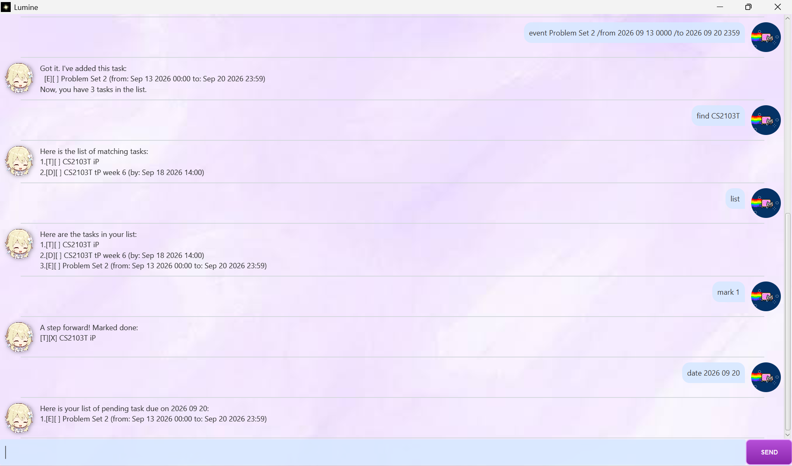

# Lumine User Guide

Lumine is a task-management chatbot for keeping track of to-do tasks, deadlines, and events. It is
designed for quick CLI input in a simple conversation window.



## Quick start

1. Download and open lumine.jar (tag: v0.2) from release.
2. Try it out by typing in a command in the input box and press **Enter** or click **SEND**.

Some commands to try out:

* `todo read a book` : Adds a to-do task - read a book.
* `deadline submit report /by 2026 09 20` : Adds a deadline - submit report by 2026 09 20.
* `list` : Shows all tasks in a list.
* `mark 1` : Marks the index 1 task as done.
* `bye` : Exits Lumine.

## Features

### Command format

* Commands are written in lowercase.
* Text in `DESCRIPTION`, `TIME`, `DATE`, and `KEYWORD` represents information you provide.
* Task numbers are positive integers and refer to the numbered tasks in the full list.
* Date and date-time values use `yyyy MM dd` and `yyyy MM dd HHmm`, respectively. For example, `2026 09 20`
  means 20 September 2026, while `2026 09 20 1430` means 20 September 2026 at 14:30.
* Free-form time text such as `Friday` or `2pm` is also accepted for deadlines and events. However, only structured dates
  are used by the `date` command.

### Adding a to-do task: `todo`

Adds a task without a deadline or time range.

Format: `todo DESCRIPTION`

Example:

```text
todo read a book
```

### Adding a deadline: `deadline`

Adds a task that must be completed by a specified time.

Format: `deadline DESCRIPTION /by TIME`

Examples:

```text
deadline submit report /by 2026 09 20
deadline call supplier /by Friday 2pm
```

The `/by` marker is required, and both the description and time must be non-empty.

### Adding an event: `event`

Adds a task with a start time and an end time.

Format: `event DESCRIPTION /from START_TIME /to END_TIME`

Example:

```text
event project meeting /from 2026 09 20 1400 /to 2026 09 20 1530
```

The `/from` and `/to` markers are required, and all three fields must be non-empty.
If either time is a calendar date, both must use `yyyy MM dd HHmm`, and the end must be strictly later
than the start. Two free-text time values are also accepted.

### Listing all tasks: `list`

Shows every task and its current number.

Format: `list`

Tasks are displayed using a type and status indicator:

* `[T][ ]` — incomplete to-do task
* `[D][ ]` — incomplete deadline
* `[E][ ]` — incomplete event
* `[T][X]` — completed task status

Use the number shown by `list` with `mark`, `unmark`, and `delete`.

### Finding tasks: `find`

Finds tasks whose descriptions contain the given keyword. The search is case-sensitive and matches part of a
description, not just complete words.

Format: `find KEYWORD`

Examples:

```text
find report
find meeting
```

The result keeps each matching task's number from the full task list. If there are no matches, Lumine reports that
it could not find a task containing the keyword.

### Viewing tasks due on a date: `date`

Shows pending deadlines due on a date and pending events whose end date is that date. Completed tasks are not shown.

Format: `date DATE`

Example:

```text
date 2026 09 20
```

The date must be a valid calendar date in exactly `yyyy MM dd` format. For example, `date 2026 02 30` is rejected.
To act on a task returned by a date search, run `list` and use its number from the full list.

### Marking a task as done: `mark`

Marks the selected task as completed.

Format: `mark TASK_NUMBER`

Example:

```text
mark 2
```

### Marking a task as not done: `unmark`

Changes a completed task back to incomplete.

Format: `unmark TASK_NUMBER`

Example:

```text
unmark 2
```

### Deleting a task: `delete`

Removes the selected task permanently from the current task list.

Format: `delete TASK_NUMBER`

Example:

```text
delete 3
```

### Undoing a change: `undo`

Reverses the most recent successful change to the task list. Adding, marking, unmarking, and deleting are changes;
commands such as `list`, `find`, and `date` do not replace the change that can be undone.

Format: `undo`

Only one change can be undone. After an undo, another `undo` reports that there is no command to undo.

### Exiting Lumine: `bye`

Closes the application.

Format: `bye`

## Saving your data

Lumine saves the task list automatically after every successful add, mark, unmark, delete, and undo operation. No
manual save command is needed. When Lumine starts again, it loads tasks from `data/lumine.txt` relative to the JAR file
directory.

If the save file is missing, Lumine starts with an empty list and creates the file after the first successful change.
So, keep a backup before editing the file manually; malformed saved records cannot be loaded.

## FAQ

**Why did my command fail?**  Check the command spelling, required markers such as `/by`, `/from`, and `/to`, and
the required date format. Lumine displays an explanation when it cannot parse a command.

**How do I know which number to use?**  Run `list`. The number immediately before a task is its task number.

**Can I use natural-language dates such as `tomorrow`?**  You may use free-form text for a deadline or event, but
the `date` command can filter only structured dates in `yyyy MM dd` format.

## Command summary

| Action | Format | Example |
| --- | --- | --- |
| Add to-do | `todo DESCRIPTION` | `todo read a book` |
| Add deadline | `deadline DESCRIPTION /by TIME` | `deadline submit report /by 2026 09 20` |
| Add event | `event DESCRIPTION /from START_TIME /to END_TIME` | `event meeting /from 2pm /to 4pm` |
| List tasks | `list` | `list` |
| Find tasks | `find KEYWORD` | `find report` |
| View tasks due on a date | `date DATE` | `date 2026 09 20` |
| Mark done | `mark TASK_NUMBER` | `mark 1` |
| Mark not done | `unmark TASK_NUMBER` | `unmark 1` |
| Delete task | `delete TASK_NUMBER` | `delete 1` |
| Undo latest change | `undo` | `undo` |
| Exit | `bye` | `bye` |
